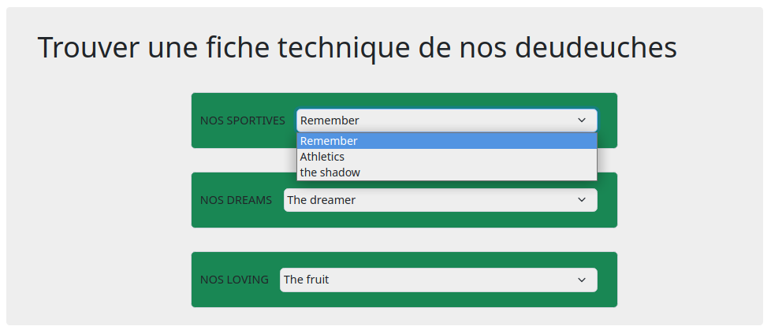

# KsSelectOption

## Exercice d'insertion dans le Dom d'éléments html en javascript 


### Objectifs

Crée une interface utilisateur avec un titre et un formulaire contenant des sélecteurs pour différentes voitures, tout en javascript et en utilisant la fonction qui creait des éléments.


```javascript
  /**
  *
  * Fonction générique qui crée un element , ajoute des attributs, et insere dans le DOM
  * @param String nom de la balise à créer
  * @param Node container dans lequel inserer l'élément
  * @param Object liste des attributs à ajouter sur l'élémént
  * @return  Node : l'élément créer
  */
  drawElement: (tagName, parentElem, attributesList = {}) => {
  
  }
   ```
   